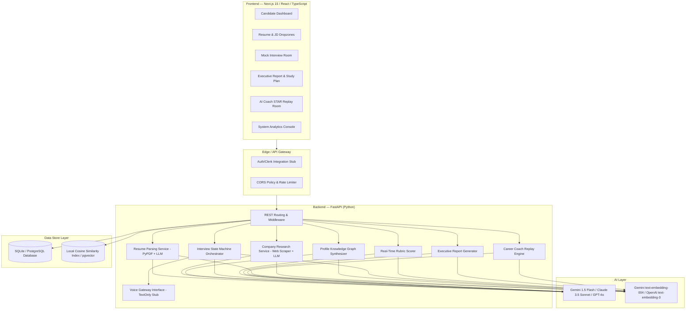
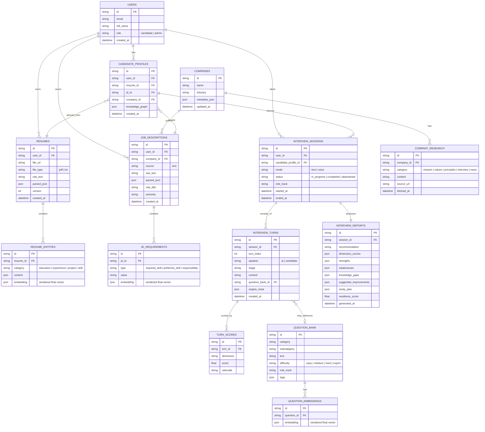

# EVAL. — AI Recruitment & Interview Platform

EVAL. is a production-ready, world-class AI Recruitment & Interview Platform. It conducts realistic, adaptive candidate interviews matching the style and rigor of top-tier organizations (Google, Microsoft, Amazon, Meta, OpenAI, etc.). 

The platform parses candidate resumes, analyzes job descriptions, crawls company websites, constructs a knowledge graph of candidate suitability, conducts adaptive mock interviews with dynamic follow-up questioning, evaluates answers in real-time using recruiter-style rubrics (including STAR method check), and compiles detailed executive feedback and study plans.

---

## 1. System Architecture Diagram



---

## 2. Database Schema & ER Diagram

The platform utilizes a hybrid data layer designed for transparent portability:
- **SQLite** for zero-dependency local development (storing embeddings as serialized arrays in standard tables, performing cosine similarity calculations in Python).
- **PostgreSQL + pgvector** for production deployments.



---

## 3. Folder Structure

```
ai-recruitment-platform/
├── package.json              # Concurrently run dev servers config
├── run.ps1                   # Win PowerShell orchestration script
├── apps/
│   ├── api/                  # FastAPI backend
│   │   ├── requirements.txt  # Python packages
│   │   ├── app/
│   │   │   ├── main.py       # API entrypoint, CORS & startup
│   │   │   ├── api/          # Route handlers
│   │   │   │   ├── admin.py
│   │   │   │   ├── interviews.py
│   │   │   │   ├── job_descriptions.py
│   │   │   │   ├── reports.py
│   │   │   │   └── resumes.py
│   │   │   ├── db/           # Connection & vector store
│   │   │   │   ├── database.py
│   │   │   │   └── vector_store.py
│   │   │   ├── models/       # SQLAlchemy schemas
│   │   │   │   └── models.py
│   │   │   ├── schemas/      # Pydantic schemas
│   │   │   │   └── schemas.py
│   │   │   ├── ai/           # LLM Providers & Fallbacks
│   │   │   │   └── providers.py
│   │   │   └── services/     # Business logic layers
│   │   │       ├── parsing.py
│   │   │       ├── research.py
│   │   │       ├── profile.py
│   │   │       ├── scoring.py
│   │   │       ├── reporting.py
│   │   │       ├── coaching.py
│   │   │       ├── voice/
│   │   │       │   └── gateway.py
│   │   │       └── interview_engine/
│   │   │           └── engine.py
│   │   └── tests/            # Test suite
│   │       └── test_interview.py
│   └── web/                  # Next.js 15 frontend
│       ├── package.json
│       ├── tailwind.config.ts
│       └── src/
│           └── app/
│               ├── globals.css
│               ├── layout.tsx
│               └── page.tsx  # Dashboard & Interview room UI
```

---

## 4. Local Setup and Running

Ensure you have **Python 3.14+** and **Node 24+** installed.

### Step 1: Clone and Configuration
Configure the environment variables in a terminal session or `.env` file (if you have them, otherwise the application will run in **offline fallback mode** using precompiled schemas and mock reasoning results to make development easier):
```bash
# Set either Gemini (Default) or OpenAI / Anthropic key
export GEMINI_API_KEY="your-gemini-key"
export OPENAI_API_KEY="your-openai-key"
```

### Step 2: Auto Setup using PowerShell
From the project root directory, run the PowerShell installer:
```powershell
# Run setup script
.\run.ps1 -Action setup
```
This command:
1. Installs root dependencies (`concurrently`).
2. Creates a Python virtual environment in `apps/api/.venv` and installs `requirements.txt`.
3. Installs Next.js dependencies (`lucide-react`, etc.) in `apps/web/node_modules`.

### Step 3: Run Development Servers
Start both servers concurrently:
```powershell
.\run.ps1 -Action dev
```
- **Next.js Web Frontend**: http://localhost:3000
- **FastAPI Backend API**: http://localhost:8000
- **Interactive OpenAPI Docs**: http://localhost:8000/docs

---

## 5. API Documentation

### Resumes Router
- `POST /api/resumes/upload`
  - Upload PDF/TXT resume. Resolves or registers user.
  - Body: Form data (`email`, `full_name`, `file`)
  - Response: `ResumeResponse`
- `GET /api/resumes/{resume_id}`
  - Retrieve parsed resume entities and JSON layout.

### Job Descriptions Router
- `POST /api/job-descriptions/analyze`
  - Research target company name, parse JD criteria, store vectors.
  - Body: JSON `JdRequest`
  - Response: `JdResponse`

### Interviews Router
- `POST /api/interviews/session`
  - Compile profile knowledge graph and start adaptive interview.
  - Body: JSON `InterviewStartRequest`
  - Response: `InterviewSessionResponse`
- `POST /api/interviews/session/{session_id}/answer`
  - Submit candidate response. Returns next AI question. Triggers background scoring tasks.
  - Body: JSON `AnswerRequest`
  - Response: Turn-transition meta dictionary.
- `GET /api/interviews/session/{session_id}/history`
  - Get complete sorted transcript.

### Reports Router
- `GET /api/reports/session/{session_id}`
  - Fetch compiled executive evaluation report.
- `GET /api/reports/turn/{turn_id}/coach`
  - Fetch coach critique, structural warnings, and STAR rewrite for a specific turn.

### Admin Router
- `GET /api/admin/analytics`
  - Fetch total users, session distribution, and activity queue.
- `POST /api/admin/seed-questions`
  - Seed the database question bank (called automatically on mount).

---

## 6. Testing Strategy

We test models, databases, routing, scoring pipelines, and state machine transitions using `pytest`.

### Run tests:
```bash
cd apps/api
.venv\Scripts\activate
pytest tests/
```
The test suite utilizes an in-memory SQLite database instance (`sqlite:///:memory:`) to verify:
1. User registration schema constraint.
2. Resume and JD relationships.
3. Turn-by-turn stage progression within `InterviewEngine` (Greeting -> Answer -> Followup).
4. Run evaluation, validation scoring, and final report generation.

---

## 7. Security Checklist

- [ ] **Data Isolation**: All operations filter records by `user_id` to prevent cross-candidate data leakages.
- [ ] **Input Sanitization**: PDF parser filters out malicious code strings prior to loading them into LLM system prompts.
- [ ] **CORS Settings**: Backend CORS middleware blocks unauthorized clients (restricted in production configuration).
- [ ] **Environment Isolation**: Database credentials, tokens, and LLM API keys are loaded strictly from system variables.
- [ ] **Secure file handling**: PDF reader limits chunk sizes, preventing DoS exhaustion on memory buffers.

---

## 8. Deployment Guide

### Backend (Dockerized on Fly.io/Railway)
1. Add a `Dockerfile` under `apps/api` specifying a python environment:
   ```dockerfile
   FROM python:3.11-slim
   WORKDIR /app
   COPY requirements.txt .
   RUN pip install -r requirements.txt
   COPY . .
   CMD ["uvicorn", "app.main:app", "--host", "0.0.0.0", "--port", "8080"]
   ```
2. Link target environment secrets (`DATABASE_URL` pointing to PostgreSQL with pgvector, API keys).
3. Push to Fly.io or Render.

### Frontend (Vercel)
1. Set the Next.js target environment variable `NEXT_PUBLIC_API_URL` pointing to your deployed API server.
2. Connect root workspace to Vercel repository, set root directory to `apps/web`.
3. Deploy!
